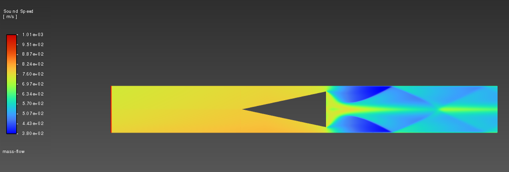
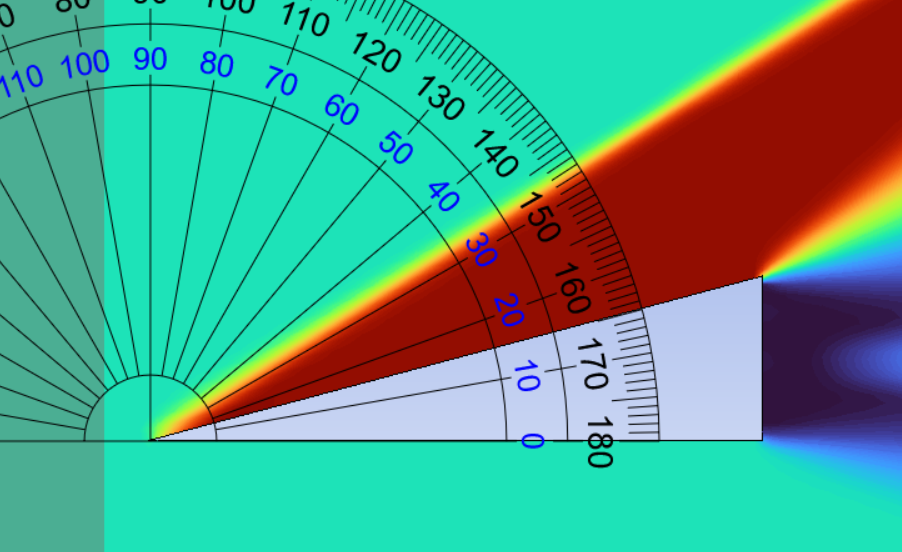

# Analysis-of-Supersonic-Flow-Engines
Design and optimization of supersonic flow engines to improve performance and efficiency through parametric analysis and CFD methods

# Overview

This repository focuses on the design, analysis, and optimization of supersonic flow engines. The initial work studies shock formation inside an infinite wedge cavity, aiming to understand supersonic flow behavior and provide insights for engine performance improvement.

 **Note:** The `main` branch currently contains work related **only to shock formation inside an infinite wedge cavity**. Future branches will extend to full engine design and parametric optimization studies.

# Objectives

- Implement numerical solvers for supersonic flow and shock analysis.
- Study shock formation and interactions within an infinite wedge cavity.
- Conduct parametric analysis to explore the effect of wedge geometry on flow patterns.
- Optimize flow characteristics for enhanced engine efficiency and stability.
- Validate results through grid convergence and benchmarking.

# Infinite Wedge inside Rectangular Cavity with Steady State Shock Formation

- An infitnite wedge is taken inside a rectangualr cavity with air entering in at Mach 2.5
- Ansys Fluent solver is used with ideal gas settings and slip boundary so as to validate the results using Theta-Beta-M relations as given in Anderson High Speed Gas Dynamics.
- Pressure far fields are taken as boundary conditions to accurately simulate the setup.
- Pressure recovery ratio is calculated using probes set at 2 different line intergals, one at inlet and one at exit. Point probes are also set to calculate precide pressure recovery ratio.
- The $\theta$ - $\beta$ - M relation is given by:

  $\tan\theta = 2\cot\beta \frac{M^2 \sin^2\beta - 1}{M^2 (\gamma + \cos 2\beta) + 2}$
- Half angle of the wedge is taken as 12 degrees and by the shock relation we get Beta angle = 36 degrees.
- **Outcome** - Reovery Mach number is found to be 1.74 and Recovery pressure ratio is found to be 2.42 which is 0.5% lesser than the value predicted by Compressible Shock Pressure relations.

# Validation

- A validation case with just a wedge is taken and by shock relations we get major shock angle as 33.5 degrees.
- Upon measuring this angle in our simulations we get around 33 degrees angle hence verifying that the results are completely valid in the setup.

# Simplified 2D Ramjet CFD analysis with Approximated Boundary Layer Interactions

A simplified 2D ramjet geometry is taken with heavy emphasis on inlet shock wedge with boundary effects being approximated by logarithmic functions.
The goal is to see formation of small lower pressure/mach areas for ideal position of flameholders.

# Objectives

- Implement compressible flow solutions on the geometry
- Consider boundary layer effects approxximately shock angles to be near to true values
- Decide the location of flameholders and their correlation with inlet geometry

# Progress

- The project is still ongiong as I'm currently beinh held by Ansys Student version.
- The calculations done so far are validated on the account of that if the study is mesh independant it will work
- Trying to swtich to OpenFoam but combustion modelling will have to wait.
- This transient state analysis is what I have been able to do till now with the currernt resources I have.

