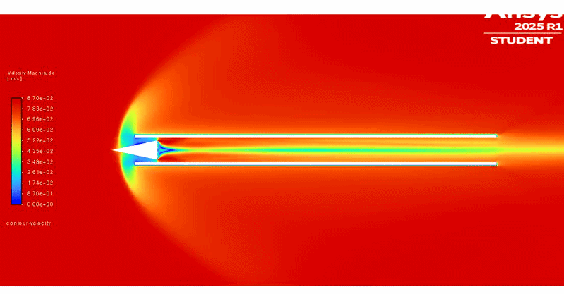

# Simplified 2D Ramjet CFD analysis with Approximated Boundary Layer Interactions

A simplified 2D ramjet geometry is taken with heavy emphasis on inlet shock wedge with boundary effects being approximated by logarithmic functions.
The goal is to see formation of small lower pressure/mach areas for ideal position of flameholders.

# Objectives

- Implement compressible flow solutions on the geometry
- Consider boundary layer effects approxximately shock angles to be near to true values
- Decide the location of flameholders and their correlation with inlet geometry

# Progress

- The project is still ongiong as I'm currently beinh held by Ansys Student version.
- The calculations done so far are validated on the account of that if the study is mesh independant it will work
- Trying to swtich to OpenFoam but combustion modelling will have to wait.
- This transient state analysis is what I have been able to do till now with the currernt resources I have.

