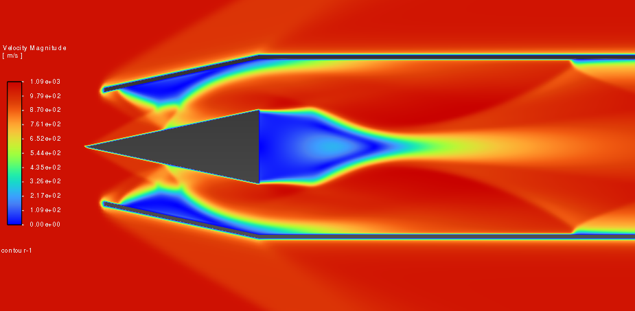
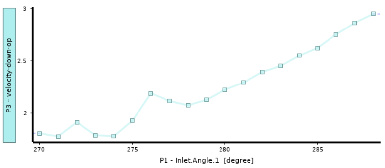

# Parametric Study to determine the best possible Inlet Design for a Simplified Ramjet Geometry

- Angle of the convering inlet duct with verticle is taken as a parameter.
- Pressure recovery is to be maximised/minimised based on problem statement.
- Different Mach Numbers donwstream are plotted against different angles to get optimum values.

# Progress

- Again I'm limited becuase of the reasons stated earlier.
- Here is the graph which I have been able to fetch till now on the basis of 24 paramteric studies

